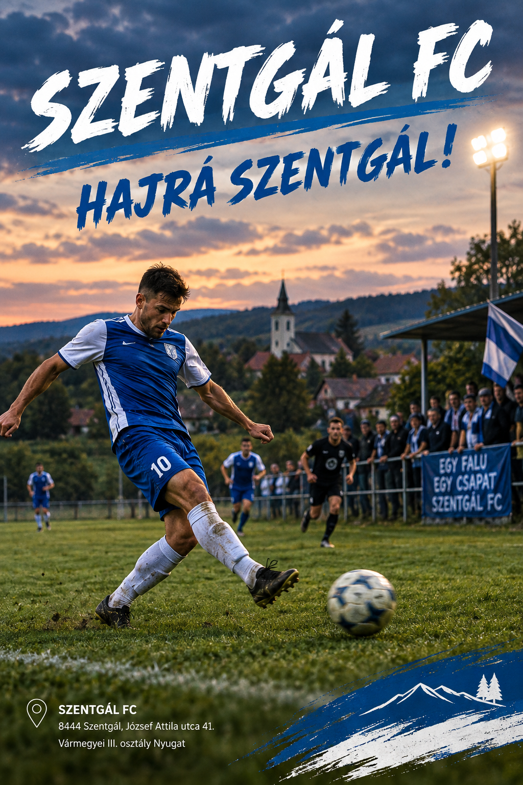
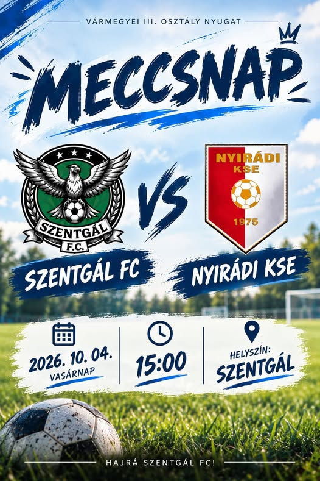

# 📄 README

## 👥 Kollaborátorok

- *[Balázs](https://github.com/B4lazs123-alt)*  
- *[Bence](https://github.com/25cbil)*  
- *[Boti](https://github.com/25cveres)*

## 💼 Munka

### 🌐 Website

[Szentgál FC](https://b4lazs123-alt.github.io/test/)

### 🖥️ Programozási nyelvek

`HTML` `CSS` `JavaScript` `Bootstrap` `Markdown`

### 📚 Munkanapló

HTML írása: Veres Botond  
HTML ötletelés: Veres Botond, Bilibok Bence, Bernátzki Balázs  
Design: Veres Botond, Bilibok Bence, Bernátzki Balázs  
Cikk, videó beágyazása: Bernátzki Balázs  
Szöveg: Bilibok Bence  
Deployment hosztolás: Veres Botond, Bernátzki Balázs  

## 🖼️ Képek

    

        
        
    

## 📸 Elérhetőségek

- **Balázs:** [Linktree](https://linktr.ee/b4lazs123) • [Instagram](https://www.instagram.com/b_bal_azs11/)
- **Boti:** [Instagram](https://www.instagram.com/botond.wav/)
- **Bence:** [Instagram](https://www.instagram.com/blbkbence/)

---